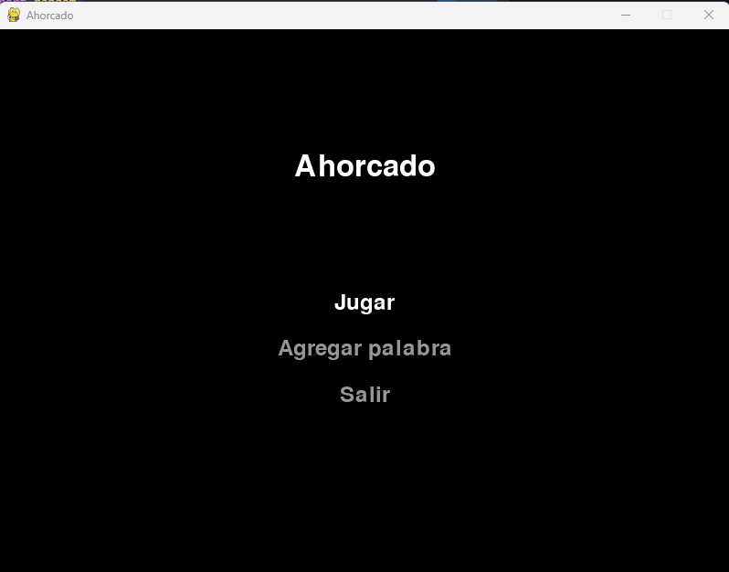
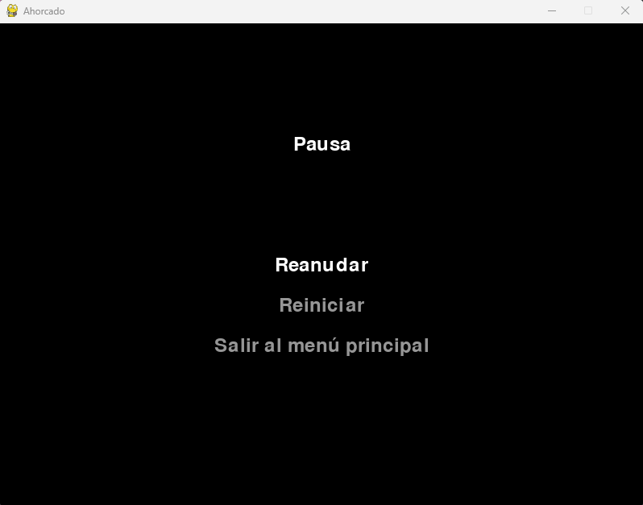
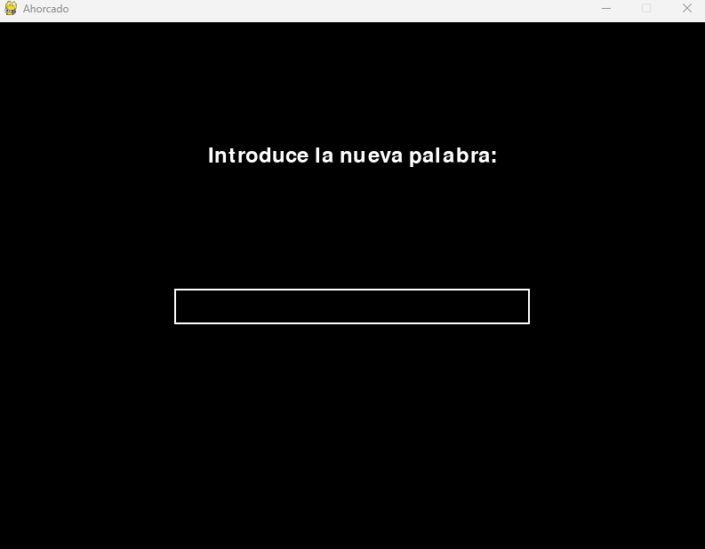
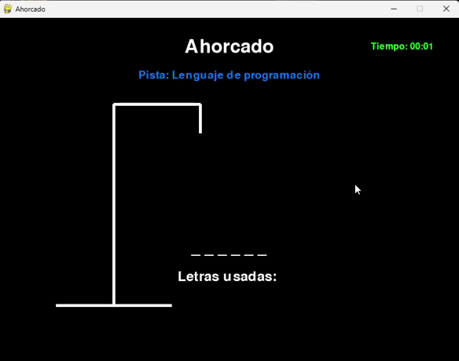

# Ahorcado en Pygame

## Descripción
Este proyecto es una implementación moderna y atractiva del clásico juego Ahorcado, desarrollado en Python utilizando la biblioteca Pygame. Ofrece una experiencia de juego interactiva con gráficos simples pero efectivos, un sistema de pistas, y la posibilidad de añadir nuevas palabras al juego.

## Capturas

### Menu principal

### Menu de pausa

### Agregar nueva palabra

### Juego

## Características
- Juego clásico de Ahorcado con interfaz gráfica
- Menú principal interactivo
- Sistema de pistas para cada palabra
- Opción para agregar nuevas palabras y pistas
- Temporizador para medir el tiempo de juego
- Menú de pausa
- Almacenamiento persistente de palabras en JSON y TXT

## Requisitos
- Python 3.x
- Pygame

## Cómo jugar
- Usa las teclas de flecha para navegar por los menús
- Presiona Enter para seleccionar una opción
- Usa el teclado para adivinar letras durante el juego
- Presiona ESC para pausar el juego

## Agregar nuevas palabras
1. Selecciona "Agregar palabra" en el menú principal
2. Ingresa la nueva palabra cuando se te solicite
3. Ingresa la pista correspondiente a la nueva palabra
4. La palabra y su pista se guardarán automáticamente y estarán disponibles en futuros juegos

---
